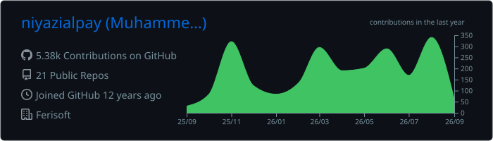
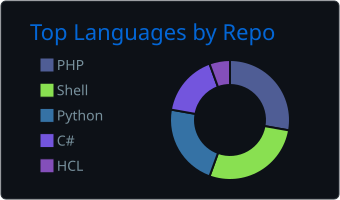
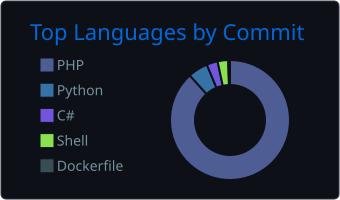
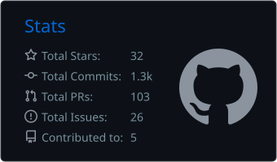
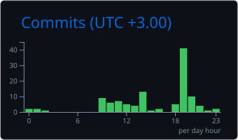

# Hi, I'm Niyazi 👋

### Software Engineer · Backend Developer · DevOps Enthusiast

I build backend applications, APIs, infrastructure automation tools and self-hosted systems.

My primary development ecosystem is **PHP and Laravel**, supported by hands-on experience with Linux servers, Docker, databases, networking, security and CI/CD systems.

## About Me

* 💻 Developing backend applications with **PHP, Laravel and REST APIs**
* 🚀 Building [AlphaPanel](https://github.com/Alpha-Panel/AlphaPanel), an open-source and Docker-native web hosting control panel
* 🐧 Working with **Linux, Docker and self-hosted infrastructure**
* ⚙️ Interested in **DevOps, CI/CD, automation and system administration**
* 🌐 Experienced with DNS, reverse proxies, VPN technologies and network management
* 🔐 Interested in application security, authentication systems and server hardening
* 🔌 Exploring electronics, embedded systems and hardware projects
* 🎻 Playing violin and piano, and exploring music production
* 🌱 Currently exploring **Go, distributed systems and AI integrations**

## Technologies

### Backend

`PHP` · `Laravel` · `Python` · `REST APIs` · `WebSockets`

### Frontend

`JavaScript` · `Vue.js` · `Inertia.js` · `Bootstrap` · `Tailwind CSS`

### Databases and Search

`MySQL` · `PostgreSQL` · `MongoDB` · `Redis` · `Memcached` · `Meilisearch`

### DevOps and Infrastructure

`Docker` · `Docker Compose` · `Linux` · `FrankenPHP` · `Caddy` · `Apache` · `Jenkins` · `GitHub Actions` · `Proxmox`

### Networking and Security

`OpenWrt` · `WireGuard` · `OpenVPN` · `Cloudflare` · `DNS` · `CrowdSec` · `Coraza WAF`

## Featured Projects

### [AlphaPanel](https://github.com/Alpha-Panel/AlphaPanel)

An open-source, self-hosted web hosting control panel developed under the **Alpha-Panel** organization as a modern alternative to traditional hosting control panels.

AlphaPanel combines a **Laravel 13 and Vue 3 management panel** with a complete **Docker Compose-based server infrastructure**. It provides a web interface for managing domains, SSL certificates, DNS records, databases, FTP users, files, PHP versions, queues, server processes and security policies without manually editing server configuration files.

The infrastructure includes **FrankenPHP, Caddy, Apache, MySQL, Redis, Meilisearch, Certbot, CrowdSec, Portainer, PhpMyAdmin, Vaultwarden, N8N and Jenkins**.

Key capabilities include:

* Domain and virtual host provisioning
* Automatic Let's Encrypt SSL certificates
* Cloudflare DNS and security management
* Per-domain PHP version and configuration management
* MySQL database and FTP user provisioning
* Browser-based file manager and terminal
* Laravel Queue, Reverb, Pulse, Horizon and Supervisor management
* Coraza WAF with OWASP Core Rule Set
* CrowdSec intrusion detection and blocking
* WebAuthn passkeys and TOTP two-factor authentication
* PhpMyAdmin single sign-on
* Real-time logs, notifications and server statistics
* Mail hosting through Mailu and Zimbra integration
* REST API for server and mail-management operations

**Technology stack:** Laravel 13 · PHP 8.5 · Vue 3 · Inertia.js · Tailwind CSS 4 · Docker Compose · FrankenPHP · Caddy · Apache · MySQL · Redis · Meilisearch

---

### [AlphaBlog](https://github.com/niyazialpay/AlphaBlog)

A modular publishing and personal content platform built with **Laravel 13**.

AlphaBlog includes full-text search with Meilisearch, WebAuthn authentication, encrypted personal notes, user management, media management, real-time services and AI integrations.

Key capabilities include:

* Blog posts, pages, categories and comments
* Modular application architecture
* Meilisearch-powered full-text search
* WebAuthn and passkey authentication
* Two-factor authentication
* Encrypted personal notes
* AI chatbot and content integrations
* Laravel Horizon, Pulse, Reverb and Telescope
* Cloudflare Turnstile protection
* Media library and image processing
* Push notifications
* IP allowlist and blocklist management

**Technology stack:** Laravel 13 · PHP · MySQL · Redis · Meilisearch · Inertia.js · WebAuthn · Laravel AI

---

### [Cloudflare DNS Manager](https://github.com/niyazialpay/CloudFlareDNSManager)

A desktop DNS management tool for adding domains, managing DNS records and updating the IP addresses of multiple Cloudflare domains simultaneously.

---

### [Laravel Meilisearch Example](https://github.com/niyazialpay/LaravelMeilisearchExample)

An example application demonstrating Laravel Scout and Meilisearch integration.

---

### [Laravel Media Library MongoDB](https://github.com/niyazialpay/laravel-medialibrary-mongodb)

MongoDB compatibility and integration work for Laravel Media Library.

---

### [WebAuthn MongoDB](https://github.com/niyazialpay/WebAuthn-MongoDB)

WebAuthn and passkey authentication integration for MongoDB-based Laravel applications.

---

### [DigitalOcean OpenVPN Terraform](https://github.com/niyazialpay/DigitalOcean-OpenVPN-Terraform)

Infrastructure automation for deploying OpenVPN resources on DigitalOcean with Terraform.

## GitHub Overview

## Blogs

* 📝 [Niyazi.Net](https://niyazi.net) — Programming, software and technology
* 🌍 [XSayfa](https://xsayfa.com) — Science, technology, art and culture
* 📰 [BirDergi](https://birdergi.org) — BirDer Association’s digital magazine featuring e-magazine issues and articles published online

## Personal Projects

* 🛒 [Moodart](https://moodart.net) — E-commerce platform

## Connect With Me

* [LinkedIn](https://www.linkedin.com/in/niyazialpay/)
* [Instagram](https://www.instagram.com/niyazialpay/)
* [Niyazi.Net](https://niyazi.net)

---

**Building software, managing infrastructure and turning ideas into working systems.**

